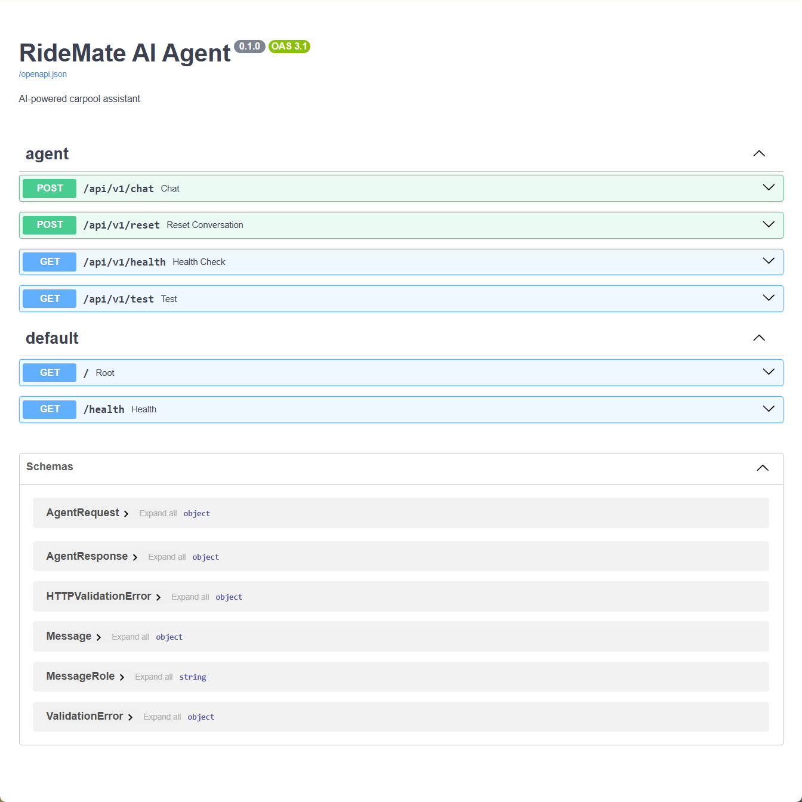
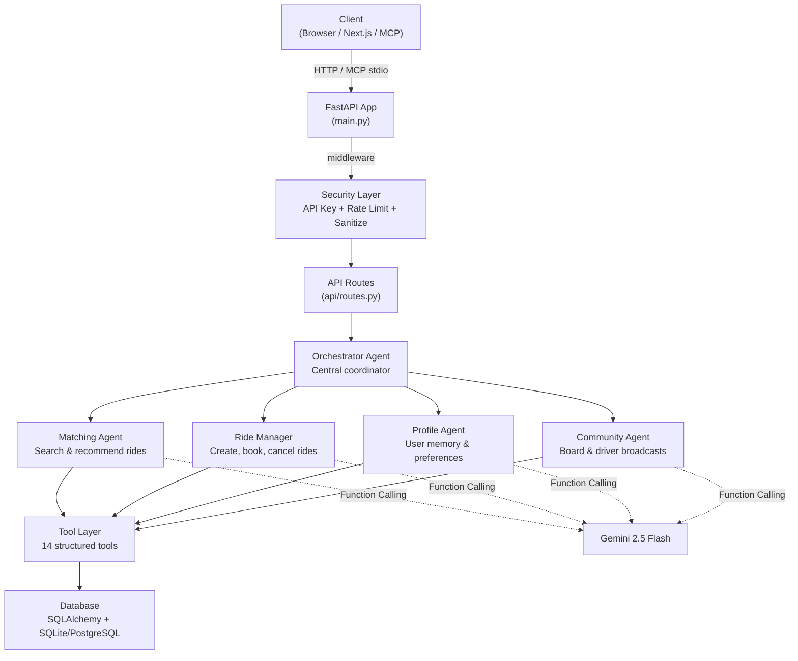

# RideMate AI 🚗

**AI-powered Carpool Assistant for university towns and small cities.**

[](https://python.org)
[](https://fastapi.tiangolo.com)
[](https://ai.google.dev)
[](LICENSE)

---

## 📖 Overview

In university towns and small cities where Uber is scarce and public transport is limited, **RideMate AI** provides an intelligent carpool assistant that users can talk to naturally. It is not a chatbot — it is a **multi-agent AI system** capable of reasoning, calling tools, and taking action on behalf of users.

### What it does

- 🔍 **Search for rides** — find available carpools by pickup/dropoff location
- 🚘 **Create & book rides** — list carpools, reserve seats, cancel bookings
- 📋 **Community board** — shared bulletin board for riders and drivers to coordinate
- 📍 **Driver status broadcast** — drivers broadcast real-time location and seat availability
- 🧠 **Personalized recommendations** — learns user patterns and proactively suggests rides
- 🛡️ **Security built-in** — rate limiting, input sanitization, API key authentication
- 🔌 **MCP Server** — expose all 14 tools to any MCP-compatible client (Claude Desktop, etc.)

---

## 🏗 Architecture

### Multi-Agent System



### Layers

| Layer | File | Responsibility |
|---|---|---|
| **Security** | `api/security.py` | API key auth, rate limiting (30 req/60s), input sanitization |
| **Routes** | `api/routes.py` | HTTP endpoints, input validation, agent lifecycle |
| **Orchestrator** | `agent/multi_agent.py` | 5-agent coordination, intent routing, tool orchestration |
| **Prompts** | `agent/prompts.py` | System prompts for all 5 specialist agents |
| **Tools** | `agent/tools.py` | 14 DB-backed tools with structured JSON responses |
| **Models** | `models/schemas.py` | Pydantic contracts for all request/response types |
| **Database** | `database/` | SQLAlchemy ORM — 6 tables, relationship-based design |
| **MCP Server** | `mcp_server.py` | MCP stdio server — exposes all tools to any MCP client |

### Request flow

1. Client sends `POST /api/v1/chat` with `user_id`, `message`, `conversation_history`
2. **Security middleware** validates input, checks rate limit, verifies API key (if enabled)
3. Route creates/retrieves an `OrchestratorAgent` (cached per user, with 4 specialist sub-agents)
4. Orchestrator ensures user exists in DB, loads profile, builds context-rich prompt
5. Gemini decides which tools to call → Orchestrator executes them → results back to Gemini
6. Gemini generates the final text response with tool results integrated
7. `AgentResponse` (message + tools_called + agents_involved) is returned

---

## 🛠 Tech Stack

| Category | Technology |
|---|---|
| **Framework** | FastAPI 0.115 |
| **AI** | Google Gemini 2.5 Flash (via `google-generativeai` SDK 0.8+) |
| **Language** | Python 3.12+ |
| **Database** | SQLite (dev) / PostgreSQL (prod) via SQLAlchemy 2.0 |
| **MCP** | MCP Python SDK 1.x — stdio transport |
| **Security** | API key auth, sliding-window rate limiter, input sanitization |
| **Deployment** | Cloud Run via Docker + cloudbuild.yaml |
| **Frontend (planned)** | Next.js + TypeScript + Tailwind CSS + shadcn/ui |
| **Auth (planned)** | Firebase Authentication |
| **Maps (planned)** | Google Maps Platform |

---

## 🚀 Getting Started

### Prerequisites

- **Python 3.12+** (as specified in `.python-version`)
- A [Gemini API Key](https://aistudio.google.com/apikey)

### 1. Clone & Install

```bash
git clone <repo-url>
cd RideMate

# Create virtual environment
python -m venv .venv

# Activate virtual environment (pick the line for your terminal):
# Windows PowerShell:
.venv\Scripts\Activate.ps1
# Windows CMD:
.venv\Scripts\activate.bat
# Windows Git Bash:
source .venv/Scripts/activate
# Mac / Linux:
source .venv/bin/activate

# Install dependencies
pip install -r requirements.txt

# Optional: install MCP server support
# (MCP uses stdio transport — no web server needed)
pip install mcp --no-deps
pip install jsonschema jsonschema-specifications pydantic-settings pyjwt
pip install "starlette<0.47.0"
```

> ⚠️ **Note:** The virtual environment is **not** committed to GitHub (listed in `.gitignore`). Every developer must create their own after cloning.

> 💡 **PowerShell execution policy error?** If you see "cannot be loaded because running scripts is disabled", run this first:
> ```powershell
> Set-ExecutionPolicy -ExecutionPolicy RemoteSigned -Scope CurrentUser
> ```

### 2. Configure Environment

Create a `.env` file in the project root:

```env
GEMINI_API_KEY=your-api-key-here
GEMINI_MODEL=gemini-2.5-flash

# Optional security configuration:
# API_KEY_REQUIRED=true       # Enable API key auth (off by default in dev)
# API_KEY=your-secret-key     # Custom API key (auto-generated if unset)
# RATE_LIMIT_MAX=30           # Max requests per window (default 30)
# RATE_LIMIT_WINDOW=60        # Window in seconds (default 60)
```

### 3. Run

**Option A — FastAPI Server:**
```bash
python main.py
```
Server starts at **http://localhost:8000**.

**Option B — MCP Server** (for Claude Desktop, Cursor, or any MCP client):
```bash
python mcp_server.py
```
Then configure your MCP client:
```json
{
  "mcpServers": {
    "ridemate": {
      "command": "python",
      "args": ["mcp_server.py"],
      "cwd": "/path/to/RideMate"
    }
  }
}
```

> ⚠️ **Won't run after restart?** Every new terminal session requires activating the venv first.
> ```bash
> source .venv/Scripts/activate   # Git Bash / Mac / Linux
> python main.py
> ```

### 4. Explore

| URL | Description |
|---|---|
| http://localhost:8000 | Interactive chat demo |
| http://localhost:8000/docs | Swagger UI — test the API directly |
| http://localhost:8000/api/v1/health | Health check |
| http://localhost:8000/api/v1/board | Community board messages |
| http://localhost:8000/api/v1/drivers/active | Active driver broadcasts |
| http://localhost:8000/api/v1/rides/active | All active rides with optional location filters |
| http://localhost:8000/api/v1/welcome/{user_id} | Personalized welcome + recommendations |

---

## 🚢 Deployment (Cloud Run)

The project includes a `cloudbuild.yaml` for one-step deployment via Google Cloud Build.

### Prerequisites

- [Google Cloud SDK](https://cloud.google.com/sdk) installed and configured
- A GCP project with Cloud Run and Cloud Build APIs enabled
- `gcloud auth login` completed

### Deploy

```bash
# Submit the build to Cloud Build
gcloud builds submit --config cloudbuild.yaml

# Or deploy directly from source:
gcloud run deploy ridemate-agent \
  --source . \
  --region us-central1 \
  --platform managed \
  --allow-unauthenticated \
  --memory 2Gi \
  --cpu 1 \
  --set-env-vars "GEMINI_API_KEY=your-key,DATABASE_URL=postgresql://..."
```

---

## 📡 API Endpoints

### `POST /api/v1/chat`

Send a message to the multi-agent AI system.

```json
// Request
{
  "user_id": "demo_user",
  "message": "Find me a ride from University to Downtown",
  "conversation_history": []
}

// Response
{
  "message": "I found 2 rides from University Campus to Downtown...",
  "tool_calls_made": ["search_rides", "get_recommendations"],
  "agents_involved": ["Orchestrator", "ProfileAgent", "MatchingAgent"],
  "needs_clarification": false
}
```

### `POST /api/v1/reset`

Reset a user's conversation with all agents.

```json
// Query param: ?user_id=demo_user
{ "status": "success", "message": "Conversation reset" }
```

### `GET /api/v1/health`

```json
{ "status": "healthy", "active_sessions": 3 }
```

### `GET /api/v1/board`

Get recent community board messages (direct DB query, no Gemini).

### `GET /api/v1/drivers/active`

Get currently active driver broadcasts with live location and seat count.

### `GET /api/v1/rides/active`

Fast, AI-free search for active rides. Query params: `from_location`, `to_location` (optional), `max_results` (default 20). Returns deduplicated results ordered by recency.

```json
// GET /api/v1/rides/active?from_location=University&max_results=5
{
  "status": "success",
  "total_found": 2,
  "results": [
    {
      "id": 1,
      "driver": "Alice",
      "from_location": "University Campus",
      "to_location": "Downtown",
      "departure_time": "2026-07-07T09:00:00",
      "available_seats": 2,
      "price": 5.5
    }
  ]
}
```

### `GET /api/v1/welcome/{user_id}`

Personalized greeting with stats, recommendations, and upcoming rides.

---

## 🔧 Available Tools

The multi-agent system has access to **14 callable tools** across 5 categories:

### Ride Discovery

| Tool | Description |
|---|---|
| `search_rides` | Find available rides by pickup/dropoff location (ILIKE partial match) |
| `get_active_drivers` | See all drivers currently broadcasting their location |
| `get_recommendations` | Personalized ride suggestions based on booking history |

### Ride Management

| Tool | Description |
|---|---|
| `create_ride` | List a new carpool as a driver — route, time, seats, price |
| `book_ride` | Reserve seats on a specific ride, auto-updates seat count |
| `cancel_booking` | Cancel a reservation and free up the seats |
| `get_my_rides` | All rides as driver or rider, with status for each |

### Profile & Preferences

| Tool | Description |
|---|---|
| `get_or_create_user` | Register new user or retrieve existing one |
| `get_user_profile` | Full profile with stats (rides offered, bookings made) |
| `update_user_preferences` | Save preferences like frequent routes, avoid tolls |

### Community Board

| Tool | Description |
|---|---|
| `post_community_message` | Write a message to the shared bulletin board |
| `get_community_messages` | Read recent board messages |
| `broadcast_status` | Driver broadcasts real-time location and seat availability |
| `end_broadcast` | End an active driver status broadcast |

> All tools are **database-backed** (SQLAlchemy ORM) and return structured JSON. The tool registry in `agent/tools.py` is self-documenting with parameter types and descriptions.

---

## 🔌 MCP Server

The MCP server (`mcp_server.py`) exposes all 14 RideMate tools via the **Model Context Protocol** using stdio transport. Any MCP-compatible client (Claude Desktop, Antigravity IDE, Cursor, etc.) can connect to it.

```json
// Example: ~/.claude/claude_desktop_config.json (Claude Desktop)
{
  "mcpServers": {
    "ridemate": {
      "command": "python",
      "args": ["mcp_server.py"],
      "cwd": "/path/to/RideMate"
    }
  }
}
```

Once connected, the client can call tools like `find_rides`, `reserve_seat`, `read_community_board`, `get_personalized_recommendations`, and more — all through natural language.

---

## 🛡️ Security

Three layers of protection are built into the API:

| Layer | Implementation | Details |
|---|---|---|
| **API Key Auth** | `api/security.py` — `APIKeyMiddleware` | Protects `/api/v1/*` endpoints. Off by default in dev; enable via `API_KEY_REQUIRED=true` in `.env`. Uses constant-time comparison. |
| **Rate Limiting** | `api/security.py` — `RateLimitMiddleware` | Sliding-window per-IP. Default: 30 req / 60s. Configurable via `RATE_LIMIT_MAX` and `RATE_LIMIT_WINDOW`. Returns 429 with `Retry-After` header. |
| **Input Sanitization** | `api/security.py` + `api/routes.py` | All user input is trimmed, length-capped, stripped of control characters. `user_id` validated against regex pattern. |

---

## 📂 Project Structure

```
RideMate/
├── main.py                # FastAPI entry point with security middleware
├── mcp_server.py          # MCP server — exposes tools via stdio
├── cloudbuild.yaml        # Cloud Run deployment config
├── .env                   # API key & model config
├── requirements.txt       # Python dependencies (fastapi, mcp, sqlalchemy, etc.)
├── DEMO_SCRIPT.md         # Demo video script (~3 min)
├── MASTER_PROMPT.md       # Project vision & design principles
│
├── api/
│   ├── __init__.py
│   ├── routes.py          # REST endpoints (/api/v1/*) with input sanitization
│   └── security.py        # API key auth, rate limiter, input sanitization
│
├── agent/
│   ├── __init__.py
│   ├── multi_agent.py     # 5-agent orchestration system (Orchestrator + 4 specialists)
│   ├── tools.py           # 14 DB-backed tools with Gemini function declarations
│   ├── prompts.py         # System prompts for all 5 agents
│   └── core.py            # (deprecated) Legacy single-agent implementation
│
├── database/
│   ├── __init__.py
│   ├── db.py              # SQLAlchemy engine, session, init_db()
│   └── models.py          # 6 tables: User, Ride, Booking, Conversation, DriverStatus, CommunityMessage
│
├── models/
│   ├── __init__.py
│   └── schemas.py         # Pydantic models (AgentRequest, AgentResponse, Message)
│
├── static/
│   └── index.html         # Interactive chat demo with dark/light mode
│
```

---

## 🗺 Roadmap

- [x] FastAPI backend skeleton
- [x] Multi-agent system with Gemini Function Calling (Orchestrator + 4 specialists)
- [x] 14 DB-backed tools: ride search, booking, community board, driver broadcasts
- [x] SQLAlchemy ORM with 6 normalized tables (User, Ride, Booking, Conversation, DriverStatus, CommunityMessage)
- [x] Personalized recommendations engine (frequent routes, saved preferences)
- [x] MCP Server — all tools exposed via Model Context Protocol
- [x] Security layer — API key auth, rate limiting, input sanitization
- [x] Swagger UI + interactive chat demo (dark/light mode)
- [x] Cloud Run deployment (Dockerfile + cloudbuild.yaml)
- [ ] More tools: `recommend_pickup`, `estimate_eta`, `weather_lookup`
- [ ] User authentication (Firebase)
- [ ] Next.js frontend with Tailwind + shadcn/ui
- [ ] Google Maps Platform integration
- [ ] Real-time notifications (WebSocket / Firebase Cloud Messaging)

---

## 📄 License

MIT
